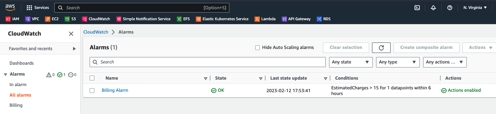
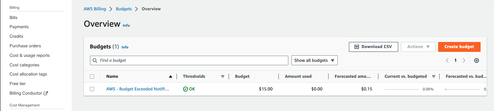
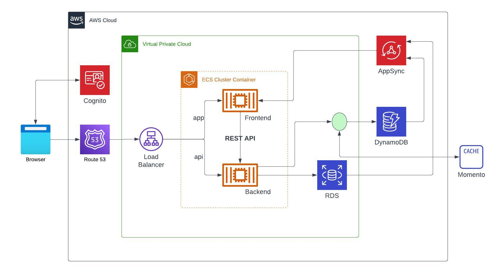
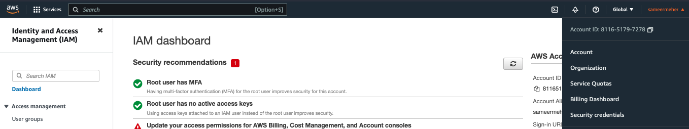
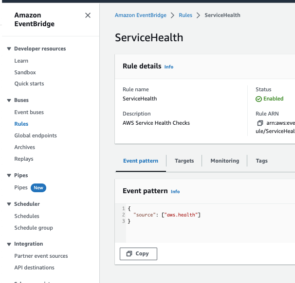
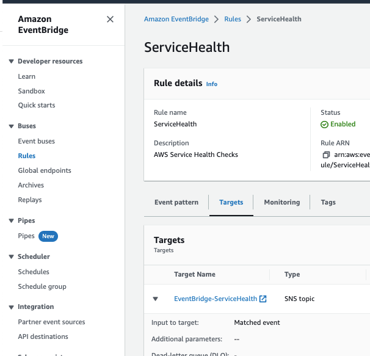
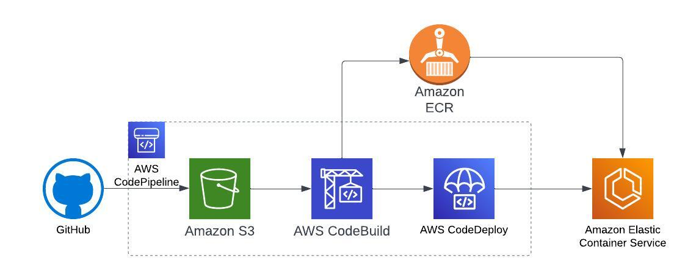

# Week 0 — Billing and Architecture

## Homework Hard Assignments
1. Set a Billing alarm

2. Set a AWS Budget

3. Generatign AWS Credentials: *Yes, I have created an IAM User with "Administrator Access" (AWS Managed Policy attached) and generated Security Credentials*
4. Using CloudShell: *Yes. Accessed CloudShell in the AWS Console*
5. Conceptual Architecture Diagram or your Napkin   
*Here is the [Public Lucid Chart Link](https://lucid.app/lucidchart/4e93669a-fffc-437b-88a7-cf7c3827d91f/edit?viewport_loc=-212%2C92%2C2368%2C1000%2C0_0&invitationId=inv_673c4483-5400-4c32-b12f-6f752e30b1f3)* - 

## Homework Stretch Assignments
1. Destroy your root account credentials, Set MFA, IAM role

2. Use EventBridge to hookup Health Dashboard to SNS and send notification when there is a service health issue

3. Review all the questions of each pillars in the Well Architected Tool
4. Create an architectural diagram (to the best of your ability) the CI/CD logical pipeline in Lucid Charts.  
*Here is the [Public Lucid Chart Link](https://lucid.app/lucidchart/30c18c8b-f8ec-4c32-b353-5e30d334f7a7/edit?viewport_loc=17%2C53%2C1579%2C752%2C0_0&invitationId=inv_88597018-f950-4c1e-bc5f-7a9c338ac96b)* - 
