# Week 2 — Distributed Tracing

## Homework Challenges
This is best week in terms of learning lot of new tools and trying out 
1. Distributing Tracing - 
   - Honeycomb - Spans and ability to capture custom attributes and build a Dashboard for observability
   - X-Ray - Instrumenting with X-Ray and able to create sub-segments with metadata and annotations
2. Error Tracing - 
   - Rollbar - Ability to capture errors occuring in the application.
3. CloudWatch Logs -
   - Logging details of what's happening in the application  


Details of Homework and Tasks attempted this week -   
1. **Honeycomb - Instrumentation to adding more custom attributes**  
    This was a new tool for me but found it most convinient tool w.r.t. Distributed Tracing. It's dead simple :)

    Created Spans and multiple sub-spans to trace the route of a request. Example below is with creation of 2 spans -
    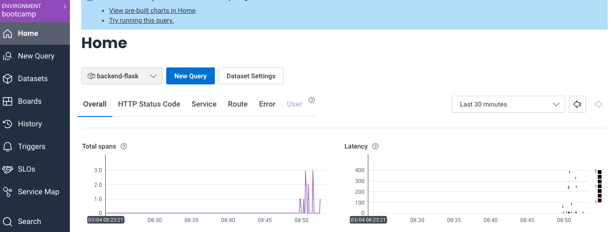
    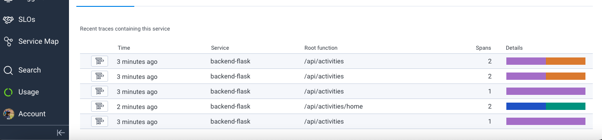

    For adding extra spans with custom attributes, I selected "Create Activity" action wherein, logged-in User could add posts which intiates "Create Activity" action/api in the background.
    ```
    now = datetime.now(timezone.utc).astimezone()
    # Adding a extra attributes to current span
    span = trace.get_current_span()
    span.set_attribute("app.now", now.isoformat())

    span.set_attribute("app.user_handle", user_handle)

    ```
    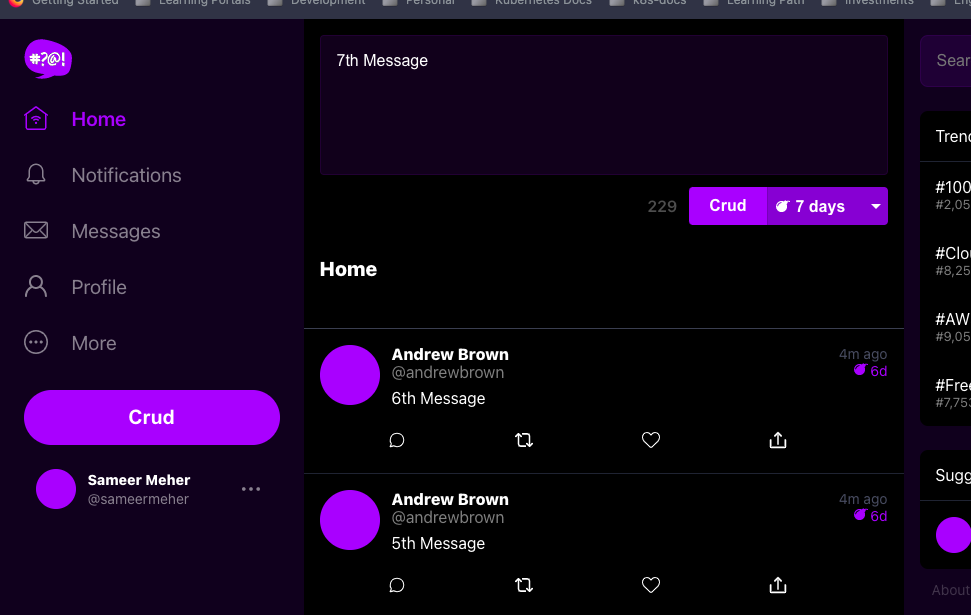

    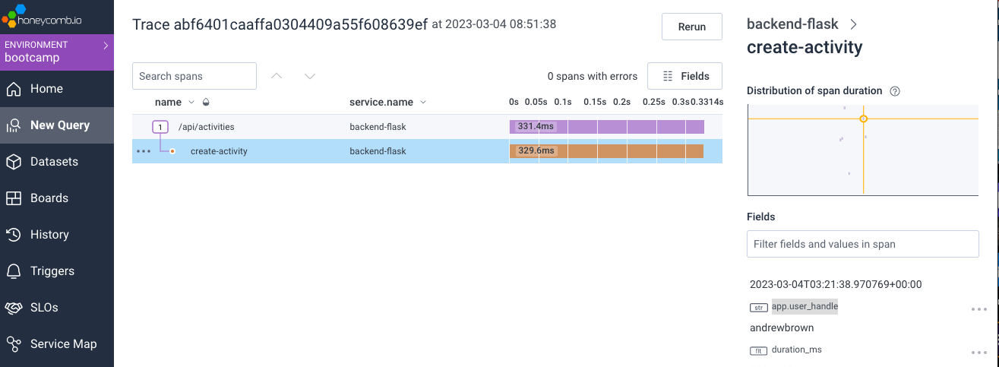

    In addition to creating and saving the query, there as a option to create a Dashboard and add query into it for better observability.
    As we don't have database integration as of now I intentionally added delay with sleep command (while Creating Activity in create_activity.py file)
    ```
    # Generate a random sleep time between 50 and 500 milliseconds to replicate delay scenario
    sleep_time = random.randint(50, 500) / 1000
    time.sleep(sleep_time)
    ```
    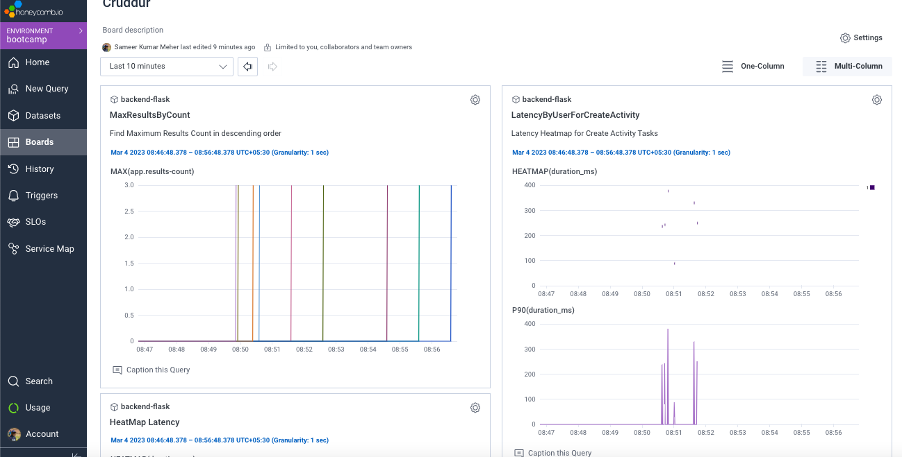
    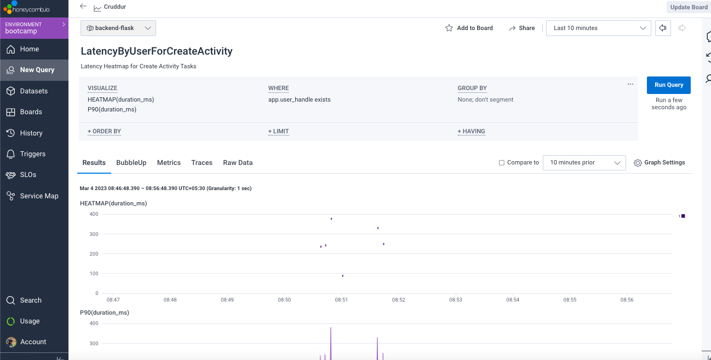

2. **X-Ray - Instrumentation to adding subsegments with metadata and annotations**  

    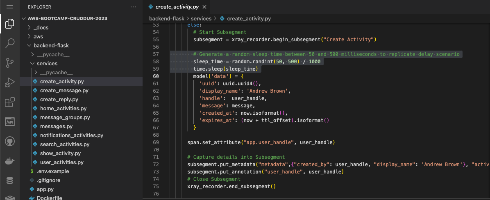
    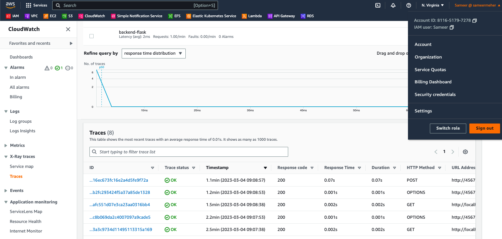
    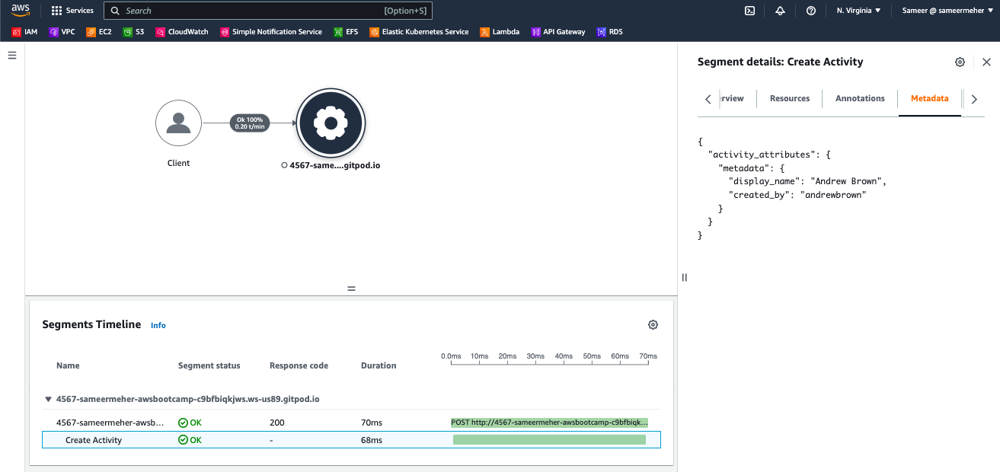
For this task I created an external python script with commands in CMD with file name "run_commands.py"  
Content of run_commands.py file  
    ```
    #!/usr/bin/env python

    import subprocess

    # Replace these commands with the ones specified in your Dockerfile CMD line
    commands = ["python3", "-m" , "flask", "run", "--host=0.0.0.0", "--port=4567"]

    # Execute the commands
    for command in commands:
        subprocess.run(command, shell=True)
    ```
    Created a separate Dockerfile as "Dockerfile2" for demo  and updated ONLY the last line to execute the python script  
    ```
    # Set the command to execute the script
    CMD ["python", "run_commands.py"]
    ```
    and build the image using the command  
    ```
    docker build -t backend:v2 -f Dockerfile2 .
    ```
3. **CloudWatch Logs**  

    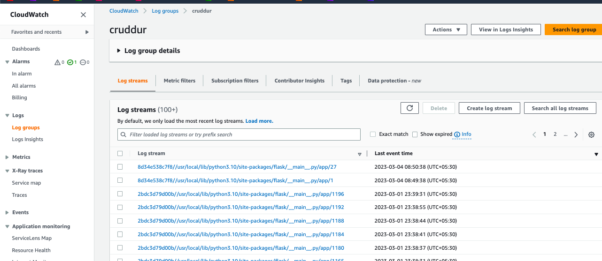
    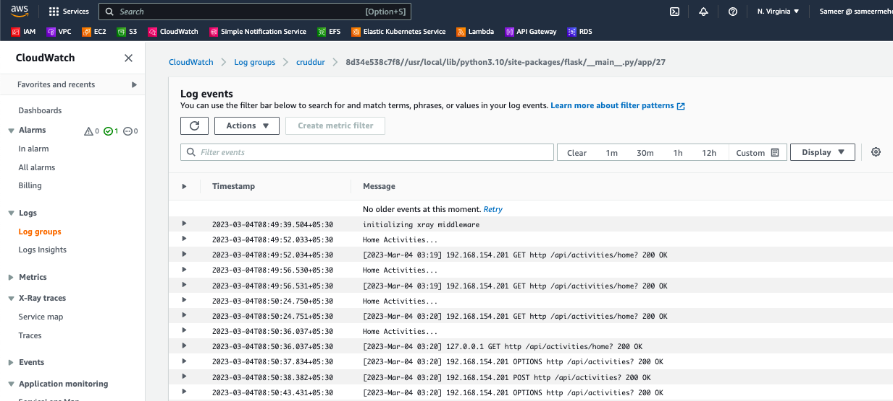

I already have a account in DockerHub. Tagged and Pushed the backed-flask image into DockerHub

    ```
    docker build -t sameerkm/backend-flask-service:1.0 .
    docker push sameerkm/backend-flask-service:1.0
    ```
4. **Rollbar - Error Tracking**  

    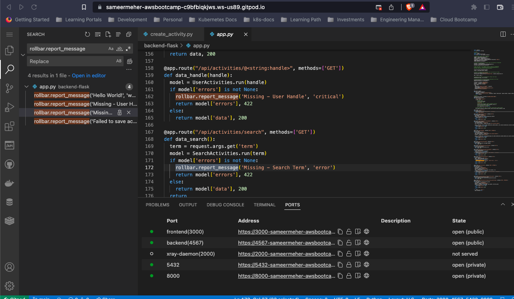
    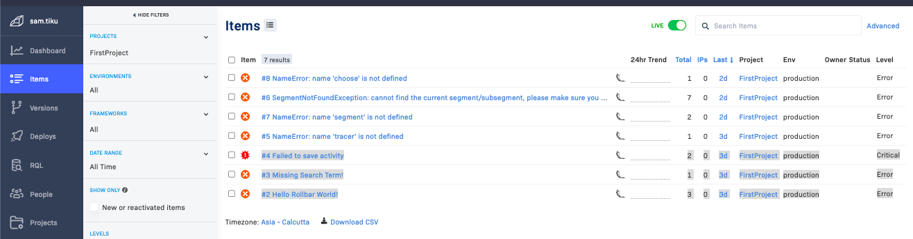

To complete this task, I lauched an EC2 instance (t2.micro), attached a Security Group (with Inbound Rule allowed from source '0.0.0.0/0'). As I wanted Docker pre-installed in the lauched EC2 instance, I added the instructions in the user-data.  
User Data Code - 
    ```
    #! /bin/sh
    yum update -y
    amazon-linux-extras install docker
    service docker start
    usermod -a -G docker ec2-user
    chkconfig docker on
    ```  
    Commands to pull Docker image, Run the Container
    ```
    [ec2-user@ip-172-31-55-147 ~]$ docker pull httpd
    Using default tag: latest
    latest: Pulling from library/httpd
    bb263680fed1: Pull complete 
    9e8776e4b876: Pull complete 
    f506d7aab652: Pull complete 
    05289ee4f284: Pull complete 
    b7f64f2f8747: Pull complete 
    Digest: sha256:db2d897cae2ad67b33435c1a5b0d6b6465137661ea7c01a5e95155f0159e1bcf
    Status: Downloaded newer image for httpd:latest
    docker.io/library/httpd:latest
    [ec2-user@ip-172-31-55-147 ~]$ docker images
    REPOSITORY   TAG       IMAGE ID       CREATED       SIZE
    httpd        latest    3a4ea134cf8e   12 days ago   145MB
    [ec2-user@ip-172-31-55-147 ~]$ docker run -d -p 80:80 --name httpd-container httpd
    5b75e76c9d15924ec58d42287b7f232c7d1b477fc5fffc199aa65be48978bffc
    [ec2-user@ip-172-31-55-147 ~]$ curl http://localhost:80
    <html><body><h1>It works!</h1></body></html>
    [ec2-user@ip-172-31-55-147 ~]$ 
    ```
    Able to access the service from Browser  
    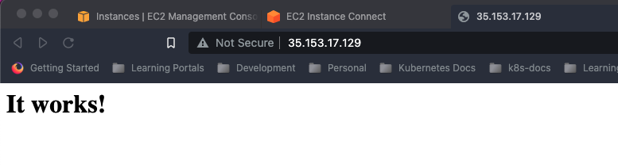
5. **Implement a healthcheck in the V3 Docker compose file**  
For this challenge, I updated the docker-compose.yml with 'healthcheck' block
    ```
    healthcheck:
    test: curl --fail http://localhost:4567/api/activities/home || exit 1
    interval: 60s
    retries: 5
    start_period: 60s
    timeout: 10s
    ``` 
    For this to work 'curl' needs to be installed in the 'backed-flash' container which can be installed by adding the following command
    ```
    RUN apt-get update && apt-get install -y curl
    ```