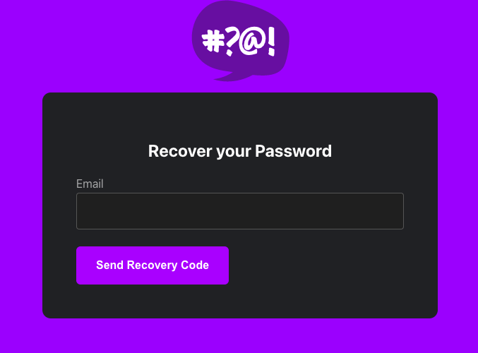

# Week 3 — Decentralized Authentication

## Required Homework

1. Watched the Live Video stream during the session completed upto a stage wherin integration of JWT token started. Continued working on the code after re-watching the complete video.
2. Executed following to force permanant password verification. 
    ```
    aws cognito-idp admin-set-user-password --username andrewbrown --password Testing123! --user-pool-id us-east-1_3JGbT8JTD --permanent
    ```
3. Integrated API calls to Amazon Cognito for - 
    * Custom SignIn Page
    * Custom SignUp Page
    * Custom Recovery Page
    * Custom Forgot password Page. 

    Now I am able to login, and regenerate new password using Password Recovery Page. Tested password recovery - it does send an email with a verification code.

    Watched the video which explain various approaches of verifying JWT tokens.

## Stretch Homework
1. Applied CSS to beautify Recovery Page. Looks pretty now.
    