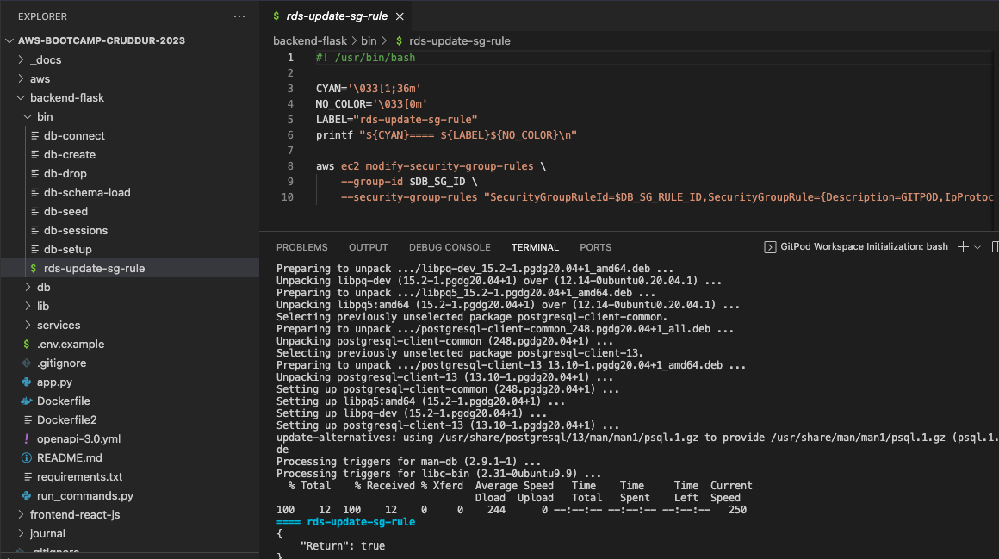
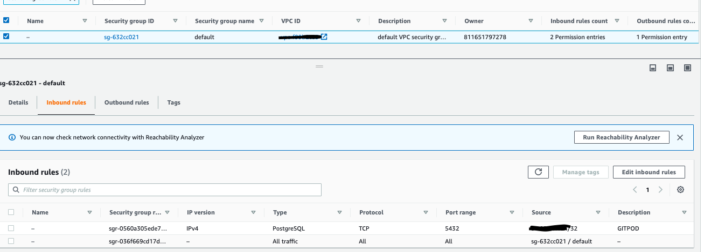
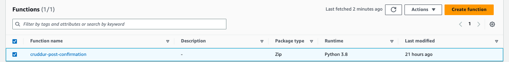
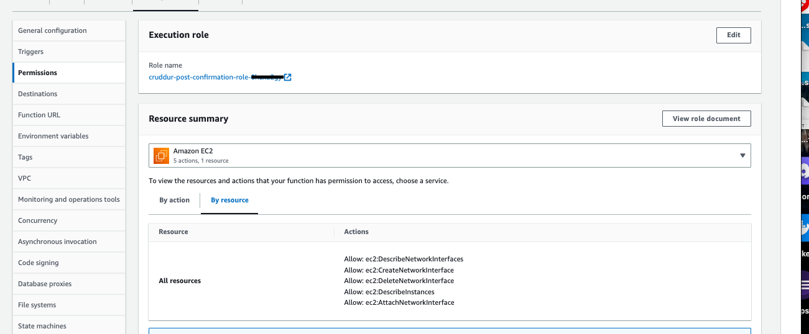
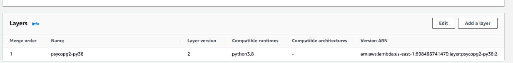
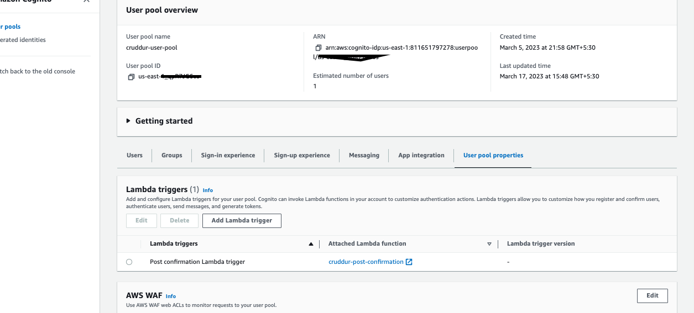
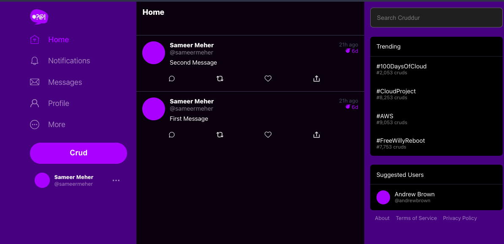
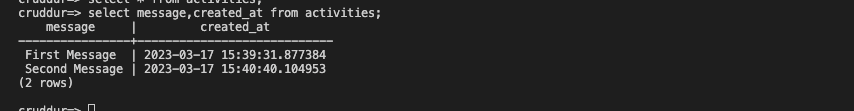

# Week 4 — Postgres and RDS

## Required Homework

1. Watched the Live Video stream during the session managed to complete in-line with whta's coverered in that session and then for entire week started going through all the recorded sessions to understand and integrate one by one.

2. Provisioned RDS PostgreSQL instance and able to modify the Security Group's Rule to allow ingress from GITPOD's IP Address only. This is initially done using AWS CLI command
    ```
    aws ec2 modify-security-group-rules \
        --group-id $DB_SG_ID \
        --security-group-rules "SecurityGroupRuleId=$DB_SG_RULE_ID,SecurityGroupRule={Description=GITPOD,IpProtocol=tcp,FromPort=5432,ToPort=5432,CidrIpv4=$GITPOD_IP/32}"
    ```

3. Command to update secuity group is wrapped inside a Bash script, and configured (inside .gitpod.yml) so that it always triggers, when the GITPOD workspace is launched.    
    ```
    command: |
      export GITPOD_IP=$(curl ifconfig.me)
      source  "$THEIA_WORKSPACE_ROOT/backend-flask/bin/rds-update-sg-rule"    
    ```
    
    GITPOD ID Updated in Security Group rule upon GitPod Launch -
    

4. Able to connect from GitPod to RDS instance securedly now (with ingress traffic only configured for GITPOD IP) and queried created tables and records in this week's exercise - for users and created activities.  
    

5. Created Cognito Post Trigger Lambda to insert users into RDS instance upon successful user account creation.  
   As part of this task - 
   - Created Lambda function with new Role and attached extra policy to fix ENI attachment issue.  
     *Here is the Stackoverflow reference with extra policy [Stackoverflow Reference](https://stackoverflow.com/questions/41177965/aws-lambdathe-provided-execution-role-does-not-have-permissions-to-call-describ)*
        
    
   - Added the Lambda Layer for psycopg2. Here is the link of Layered ARN for my region (us-east-1) 
   *Here is the link for correct ARN for your region [Lambda Layer ARN Reference](https://github.com/jetbridge/psycopg2-lambda-layer)*  
   Finally Added the following ARN - arn:aws:lambda:us-east-1:898466741470:layer:psycopg2-py38:2  
    

6. Integrated Lambda Trigger for Post Confirmation from Cognito  
    

7. Managed to Create Activities in the App  
    
    Activities are added into database  
    
