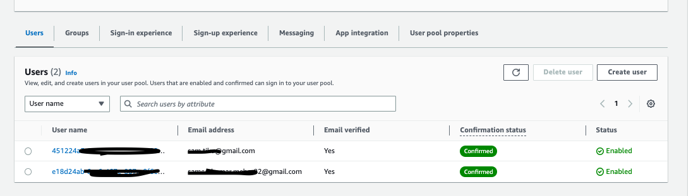
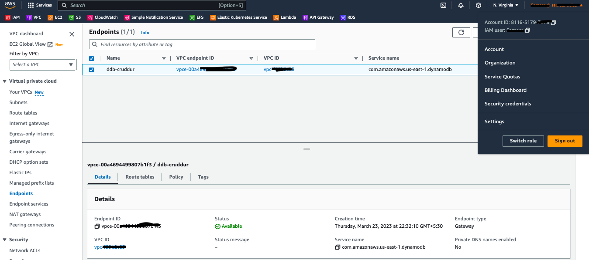
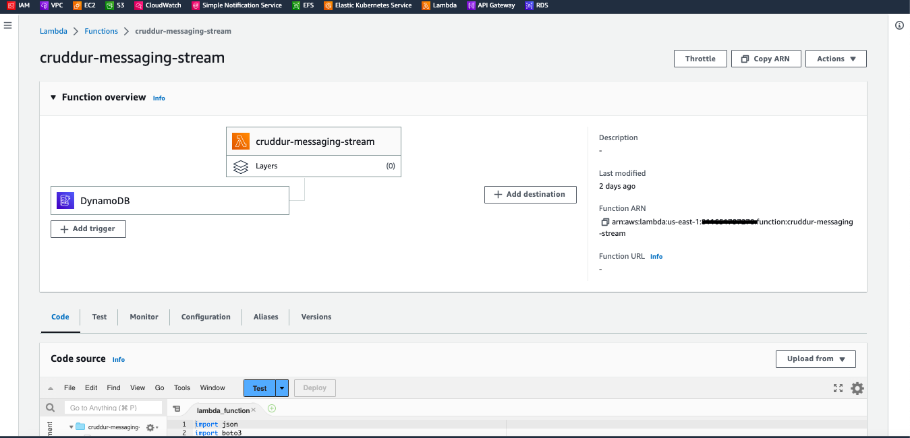
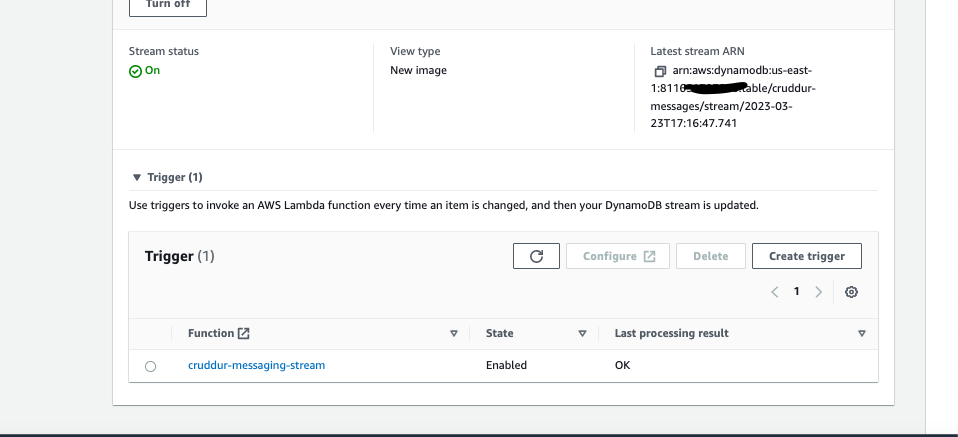
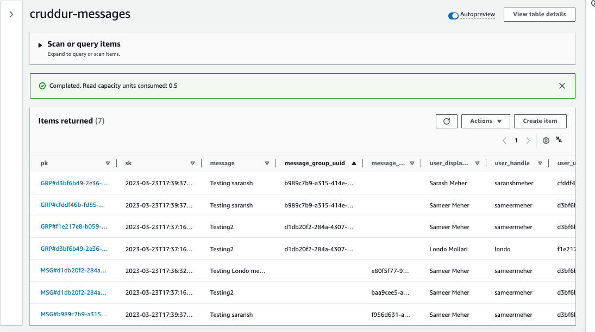
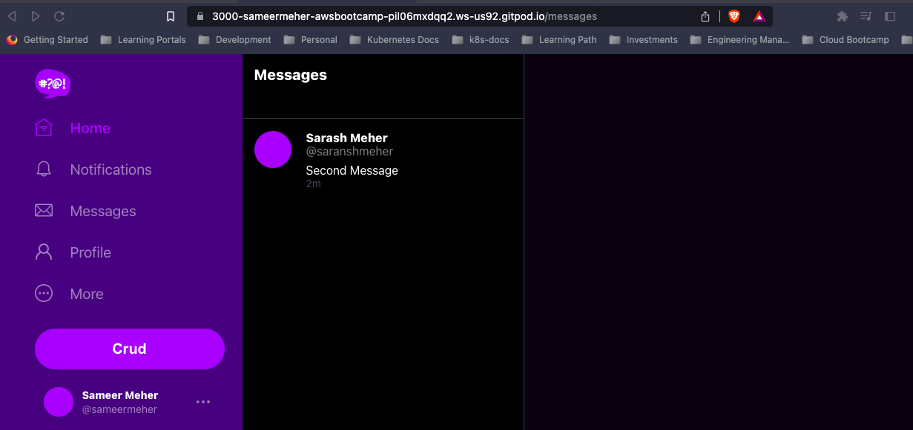
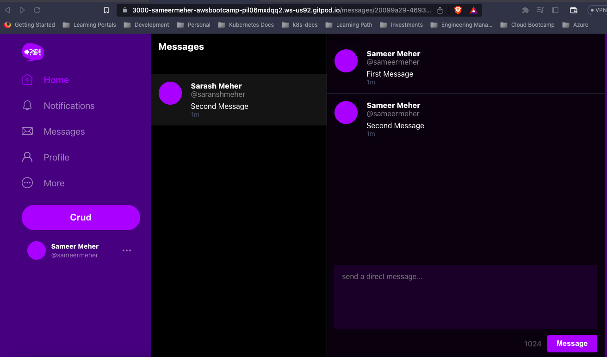

# Week 5 — DynamoDB and Serverless Caching

## Required Homework

1. Watched the Live Video stream during the session managed and leant the Single Table design concept w.r.t. DynamoDB and why it's important to think about various Access Patterns of your application.

2. Setup various DDB utility scripts to Setup as well as Teardown DynamoDB tables that includes - 
   - Schema Load 
   - List created tables
   - Scan to view items
   - Seed the data for testing loading of conversation in the app

3. Implement Patterns for Group Messages, creation of Message Group and adding Messages to existing Group.
   << Image >>

4. Created new users in Cognito (through new user registration) to test creation of messages and groups conversation.
   << Image from Cognito user pool >>
   

5. Created VPC Endpoint to avoid accessing DynamoDB over Internet.
   

6. Created the Lambda function for DynamoDB scream for messaging
   

7. Created the Trigger in DynamoDB to execute the Lambda Function   
   

8. Items created in DynamoDB table    
   

9. Messages and Group Messages creation in Cruddur App
   

   